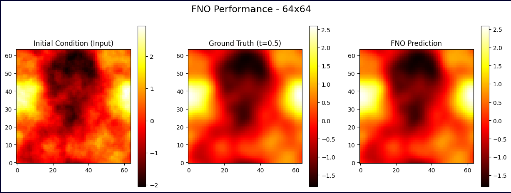
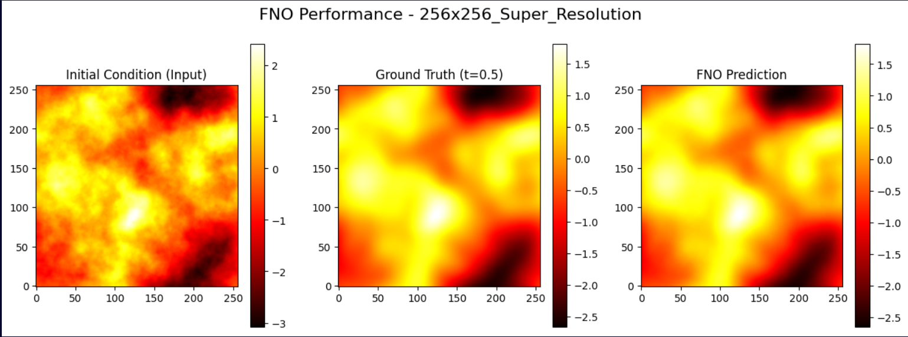
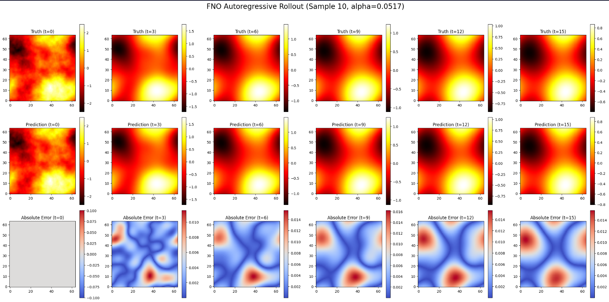

# Universal Solver for 2D Heat Equation using Fourier Neural Operators

[](https://www.python.org/)
[](https://pytorch.org/)
[](#)
[](LICENSE)


A PyTorch implementation and extension of **Fourier Neural Operators (FNOs)** to solve a *family* of 2D heat equations. It demonstrates:

- **Zero-Shot Super-Resolution**: train on low-res data → predict on higher resolutions without retraining.  
- **Universal Autoregressive Solver**: one physics-informed model that rolls out long-term trajectories across varying physical parameters.

> Inspired by: **Li et al., “Fourier Neural Operator for Parametric Partial Differential Equations.”**

---

## ✨ Highlights

- **Accurate ground truth** via a **spectral solver** (Fourier space evolution) with periodic BCs.
- **Diverse initial conditions** using **Gaussian Random Fields (GRFs)**.
- **Strict train/test split** saved as:
  - `heat_trajectories_train_64.h5`
  - `heat_trajectories_test_64.h5`
- **Universal diffusion**: thermal diffusivity α ~ U[0.01, 0.1].
  
---

## 📦 Dataset & Generation

- **Equation**: 2D heat equation with periodic boundary conditions.  
- **Ground truth**: spectral method (minimizes numerical error vs finite differences).  
- **ICs**: GRFs → smooth, random fields with varied spectra.  
- **Files**: `heat_trajectories_train_64.h5`, `heat_trajectories_test_64.h5` (and optionally high-res test, e.g., 256×256), not present in the repo, but you can generate them using the code provided.

> Each trajectory contains time-ordered snapshots suitable for autoregressive training.

---

## 🧠 Model: Fourier Neural Operator (FNO)

- Spectral convolution layers with learned Fourier filters.  
- Pointwise nonlinearity and lifting/projection layers.  
- **Autoregressive rollout** for long horizons (15 steps used in experiments).

---

## 🧪 Experiments

### 1) Zero-Shot Super-Resolution

- **Train**: 1,000 simulations at **64×64**.  
- **Test**:  
  - **64×64** → **Relative error:** **0.88%**  
  - **256×256** (no retraining) → **Relative error:** **0.90%**

**Qualitative results**

| 64×64 (train/test resolution) | 256×256 (zero-shot) |
|---|---|
|  |  |

---

### 2) Universal Autoregressive Solver

- **Train**: 20,000 trajectories, α ~ U[0.01, 0.1]).  
- **Test**: 4,000 trajectories.  
- **Final relative error:** **1.1479%** (over full rollouts).

**Overview plot**



---

## ⏱️ Performance Benchmark

The spectral solver is extremely fast for linear heat equations, so it’s a tough speed baseline.

| Method            | Total Time (4000 trajectories) | Avg / Trajectory |
|-------------------|---------------------------------|------------------|
| Numerical Solver  | **42.39 s**                     | **0.0106 s**     |
| FNO Inference     | **159.91 s**                    | **0.0400 s**     |

**Why FNO is slower here:**

1. Spectral solvers are near-optimal for this linear PDE.  
2. FNO used **15-step** autoregressive rollouts per trajectory.  

**Where FNO shines:** in complex **non-linear PDEs** (e.g., Navier–Stokes), where traditional solvers are orders of magnitude slower—FNOs can deliver **~1000×** speedups.

---

## 🚀 Quickstart

### 1. Setup

```bash
# Create environment
python -m venv .venv
source .venv/bin/activate   # Windows: .venv\Scripts\activate

# Install dependencies
pip install torch numpy h5py matplotlib tqdm 
````

---

### 2. Training & Evaluation

This repo includes **Jupyter notebooks** with full training + evaluation pipelines:

* **`2DHeat_FNO_alpha0.05.ipynb`** → Train and evaluate FNO on a fixed diffusivity (α = 0.05).
* **`2dheat-family.ipynb`** → Train a universal autoregressive FNO across a family of diffusivities α ∈ \[0.01, 0.1].

Run them directly:

```bash
jupyter notebook 2DHeat_FNO_alpha0.05.ipynb
jupyter notebook 2dheat-family.ipynb
```

---

### 3. Data Access Example (HDF5)

```python
import h5py
import numpy as np

# Load training dataset
with h5py.File("heat_trajectories_train_64.h5", "r") as f:
    X = np.array(f["X"])  # shape: [num_samples, time, H, W]
    Y = np.array(f["Y"])
print("Train set:", X.shape, Y.shape)
```

---

## 📁 Repo Structure

```
├─ 2DHeat_FNO_alpha0.05.ipynb
├─ 2dheat-family.ipynb
├─ res1a.png
├─ res1b.png
├─ res2.png
├─ requirements.txt
└─ README.md
```

---

## 🔧 Tips

* Normalize inputs/outputs per-dataset for stable training.
* Monitor rollout error vs single-step error.
* For zero-shot, keep Fourier modes consistent with resolution scaling.
* Autoregressive training benefits from scheduled teacher forcing.

---

## 🤝 Contributing

Pull requests are welcome. For major changes, please open an issue to discuss what you’d like to change.

---

## 📜 License

This project is licensed under the **MIT License**. See `LICENSE` for details.

---

## 📚 References

* **Fourier Neural Operator for Parametric PDEs**
  Zongyi Li, Nikola Kovachki, Kamyar Azizzadenesheli, Andrew Stuart, Anima Anandkumar, Burigede Liu, Kaushik Bhattacharya.
  *arXiv:2010.08895*

**BibTeX**

```bibtex
@article{li2020fourier,
  title={Fourier Neural Operator for Parametric Partial Differential Equations},
  author={Li, Zongyi and Kovachki, Nikola and Azizzadenesheli, Kamyar and Liu, Burigede and Stuart, Andrew and Bhattacharya, Kaushik and Anandkumar, Anima},
  journal={arXiv preprint arXiv:2010.08895},
  year={2020}
}
```

---

*If you use this repository or results, please cite the paper above and consider referencing this repo.*

```
